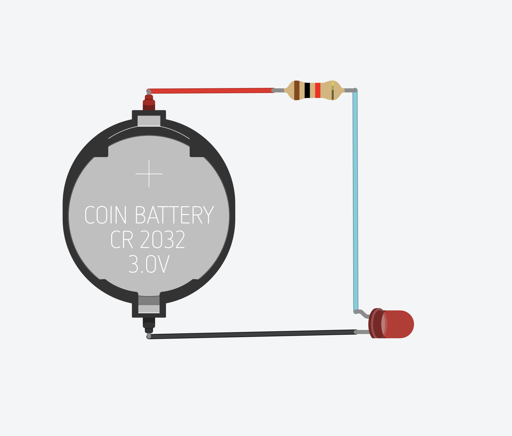
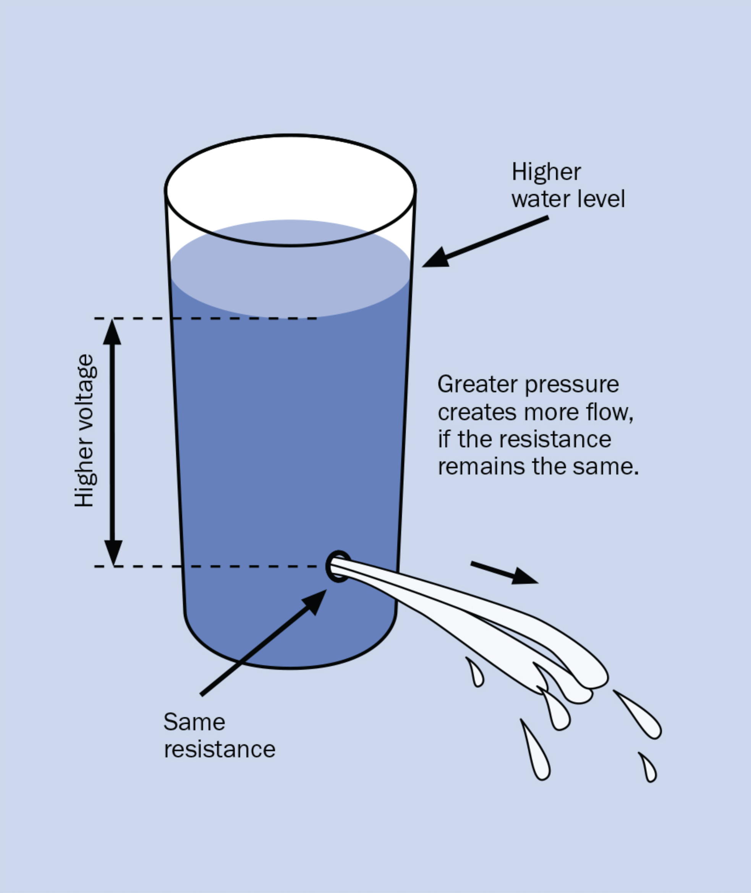
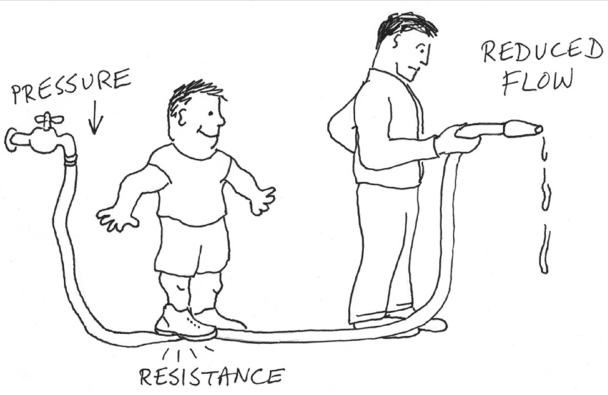
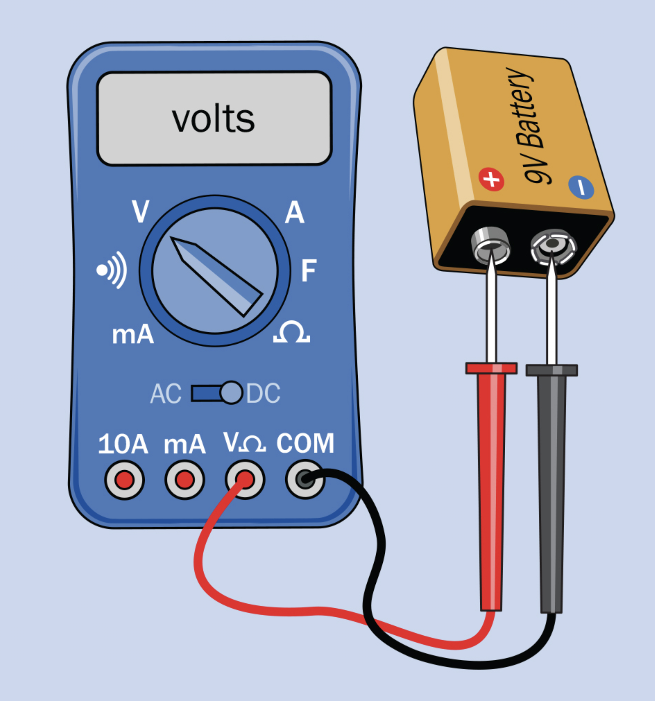
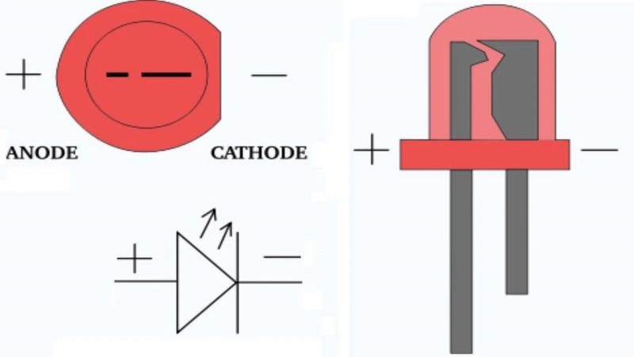
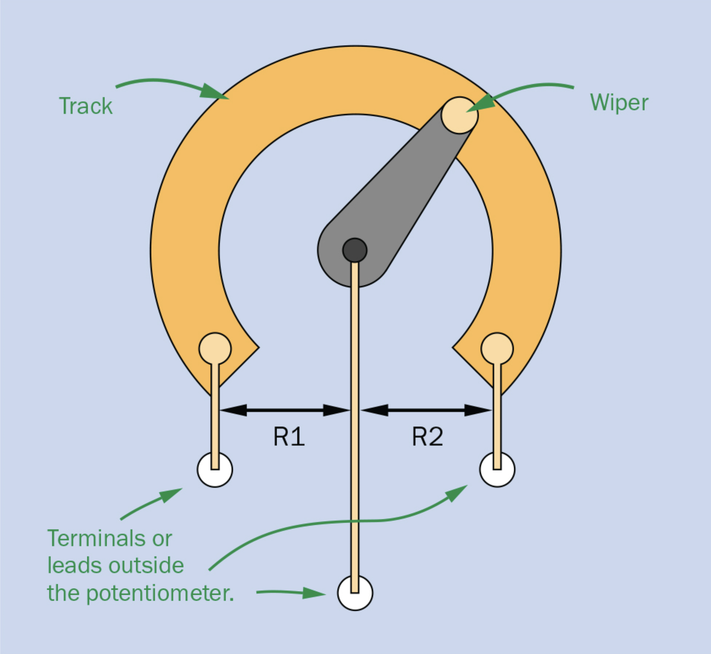

# Day 1

## CS Hardware - Ohm's Law

---

# Goal for Today

By the end of today you will:

- Build your first circuit
- Control LED (light emitting diode) brightness
- Use a multimeter
- Learn voltage, current, and resistance
- Learn how to troubleshoot circuits

---

# Today's Workflow

## Step 1

Build a circuit virtually in Tinkercad

## Step 2

Build the same circuit physically on a breadboard

## Step 3

Measure and analyze the circuit

<!-- TODO: step 4 -->


---

# Live Demo

## What are we building today?

<!-- LIVE DEMO -->
<!-- Show physical LED dimmer circuit -->

<!-- Questions:
- Why does the LED change brightness?
- What controls the current?
- Why doesn't the LED burn out? -->



<!-- TODO: move to a breadboard? -->

---

<!-- TODO: introduce Ohm's Law here? -->

---

# What Happens Without a Resistor?

- We use a resistor to safely limit current.
- This protects the LED from too much current.

An LED connected directly to a battery can:
- draw too much current
- overheat
- burn out

<!-- TODO: Ohm's Law here? -->

<!-- ---

# Debugging Is Engineering

There are:
- some ways to wire it correctly
- many ways to wire it incorrectly

Debugging is part of electronics. -->

---

<!-- 
# Why Start with Tinkercad?

Advantages:

- easier wiring + troubleshooting
- instant feedback
- safer experimentation
- no damaged components

Disadvantages:

- Simulations are sometimes inaccurate 
-->

<!-- We can focus on *understanding the circuit first* -->

---

# Electronics Is About Control

We use electronics to control:

- Light 💡
- Motion 🚗
- Sound 🔊
- Information ℹ️
- Energy ⚡️

---

# Expect mistakes

Your circuit may:

- not work
- work partially
- behave strangely

Professional engineers spend huge amounts of time debugging.

If your circuit does not work immediately **THAT IS NORMAL**

---

# LAB BREAKOUT #1

## Tinkercad Build

Components:

- battery
- resistor
- LED
- wires

Goal: *make the LED light safely*


<!-- TODO: setup tinkercad classroom -->

<!-- ---

# Virtual Circuit

Battery positive →
Resistor →
LED →
Battery negative -->

<!-- TODO: insert Tinkercad screenshot -->
<!-- Breadboard? -->

<!-- ---

# Before Starting Simulation

## Double check:

- LED polarity
- resistor present
- correct wiring
- battery orientation -->

<!-- ---

# Prediction

Before starting the simulation:

- What happens if the LED is reversed?
- What happens if the resistor is removed?
- Will the LED always light? -->

<!-- ---

# Start the Simulation

## What do you observe?

- Is the LED on?
- Is it bright?
- What happens if wiring changes? -->

<!-- ---

# Intentional Failure Test

Try:
- reversing the LED
- removing the resistor

Observe what changes. -->

<!-- ---

# Debrief

- Why did reversing the LED matter?
- Why was the resistor necessary?
- Why did some circuits fail? -->

---

# What Is Electricity?

Electricity is the movement of electrons.

Three important ideas:

- Voltage (V)
- Current (I)
- Resistance (R)



---

# Voltage

## Voltage is electrical pressure

Voltage pushes electrons through a circuit.

Analogy:
- water pressure in a pipe

Measured in:
# Volts (V)

---

# Current

## Current is flow

Current is the movement of electrical charge.

Analogy:
- water flowing through a pipe

Measured in:
# Amps (A)

---

# Resistance

## Resistance opposes current flow

Higher resistance:
- less current

Lower resistance:
- more current

Measured in:
# Ohms (Ω)



---

# Water Analogy

| Electricity | Water |
|---|---|
| Voltage | Pressure |
| Current | Flow |
| Resistance | Narrow pipe |


---

# The Battery

A battery provides voltage.

Battery terminals:

- Positive (+)
- Negative (-)



---

# Polarity

**Direction matters**

- Electricity flows through a circuit in a direction
- Some components only work when electricity flows the correct way

This is called *polarity*

---

# LEDs Have Polarity

LED:
- Light Emitting Diode

Diodes only allow current in one direction.

- Long leg = positive (+) anode
- Short leg = negative (-) cathode



---


# LAB BREAKOUT #2

## Physical Breadboard Build

Recreate the same circuit physically.

Goal:
- LED lights
- correct polarity
- clean wiring

Time:
15 minutes

<!-- ---

# Build It Physically

## Now recreate the same circuit

Using:
- Breadboard
- LED
- Resistor
- Battery
- Jumper wires -->

<!-- 

TODO: introduce breadboards in tinkercad first
---

# Breadboard

## Rapid circuit prototyping

- no soldering
- reusable
- easy to modify

---

# Breadboard Layout

## Rows are electrically connected

TODO: Insert breadboard diagram 
-->

<!-- ---

# Physical Circuit

Battery positive →
Resistor →
LED →
Battery negative -->

---

# Before Powering On

## Double check:

- LED polarity
- resistor present
- loose wires
- battery orientation

---

# Instructor Demo

## Troubleshooting

If it does NOT work:

- check polarity
- check wiring
- check loose connections
- swap components
- test battery

(sometimes you just need to take a break)

---

# Compare Virtual vs Physical

What are your first impressions?

<!--

Tinkercad:
- easier wiring
- easier visibility

Real hardware:
- loose wires
- bad connections
- physical constraints

-->

---

# The Multimeter

## Most important electronics tool

A multimeter measures:
- voltage
- resistance
- current
- continuity

---

# Instructor Demo

<!-- LIVE DEMO -->

Measure:
- battery voltage
- LED voltage
- current
- resistance
- continuity

<!-- 
Show probes placed in parallel vs. series 
-->

<!-- TODO: Insert diagram measuring voltage, current, resistance, continuity -->

---

---

# Measure the Battery

## Prediction

What voltage do you expect from a 9V battery?

Now measure it.

---

# Measuring Resistance

## Important Rule: **POWER OFF FIRST**

Resistance is measured on unpowered circuits.

---

# Measure a Resistor

- Use the multimeter to measure different resistors
- Compare measured values to color bands.

---

# Measuring Continuity

Continuity means:
- electrical connection exists

The multimeter beeps when connected.

<!-- Test:
- jumper wires
- buttons
- switches
- breadboard rows -->

---

# LAB BREAKOUT #3

## Multimeter Measurements

Measure:
- battery voltage
- current
- resistor value
- continuity

Time:
10–15 minutes

---

# Ohm’s Law

# V = I × R

This is one of the most important equations in electronics.

---

# Ohm's Law Intuition

More voltage -> more current

More resistance -> less current

---

# LED Brightness Control

## New goal

Control LED brightness using:
- resistor
- potentiometer
- button and/or switch

---

# Potentiometer (Variable resistor)

Turning the knob changes resistance.

Use:
- Center pin
- One outside pin
- Leave the other outside pin disconnected.



---

# Buttons

A button only changes the circuit while pressed.

Examples:
- keyboard keys
- doorbells
- game controller buttons

<!-- TODO: image -->
---

# Switches

A switch stays in its position until changed.

Examples:
- room light switch
- power strip
- flashlight switch

<!-- TODO: image -->
---

# LAB BREAKOUT #4

## LED Dimmer

Add the potentiometer.

Goal: *control LED brightness*

- What happens as resistance increases?
- Will brightness increase or decrease?
- Will the change feel linear?
- What happens when you add a button and/or switch

Time:
15–20 minutes

---

<!-- # LED Dimmer Circuit

Battery positive →
Fixed resistor →
Potentiometer →
LED →
Battery negative

---

# Experiment Time

Slowly rotate the potentiometer.

Observe:
- brightness
- smoothness of control

--- -->

# Why Does Brightness Change?

- Brightness depends on *current*
- Current depends on *resistance*

---

# Forward Voltage

- LEDs are not ordinary resistors.
- A green LED typically uses about 2.2 V
- This is called *forward voltage*

In a 9V circuit:

- Some voltage appears across the LED
- The rest appears across the resistor(s)

---

# Example Calculation

Assume:
- Battery = 9V
- LED forward voltage = 2.2V
- Resistance = 500 Ω

Remaining voltage:

# 9V − 2.2V = 6.8V

---

# Current Calculation

Using Ohm's Law:

```
I = V / R
I = 6.8V / 500Ω
I = 0.0136 A = 13.6 mA
```

---

# Important Observation

- Changing resistance changes current
- Changing current changes brightness

---

# Heat and Energy

- Resistors convert electrical energy into heat.
- LEDs convert energy into light & heat

<!-- 
---

# Common Mistakes

- reversed LED
- missing resistor
- loose wires
- wrong breadboard row
- dead battery
-->

---

<!-- TODO: move before physical circuit lab -->
# Safety

## Always:

- Disconnect power before rewiring
<!-- TODO: explain a short circuit (too much current) -->
- Avoid short circuits
- Wear safety glasses
- Check polarity

---

# Battery Safety

Large batteries can produce a dangerous levels of current.

Do NOT short:
- lithium batteries
- car batteries

<!-- TODO: video showing what happens -->

---

# Engineering Mindset

Good engineers:
- test
- predict
- measure
- debug
- iterate

---

# Key Takeaways

<!-- 
# Key Ideas from Today

- Voltage pushes current
- Resistance limits current
- Current controls LED brightness
- Polarity matters
- Multimeters let us observe circuits 
-->


<!--

- Why is a resistor needed?
- What happens if resistance increases?
- What does voltage measure?
- Why do LEDs have polarity?

-->

<!-- TODO: add slide on buttons / switches -->

<!-- ---

# Reach Goals

- change the order of components
- change resistance / potentiometer
- add a button and/or switch -->

<!-- 
---

# Next Time

Next steps:
- capacitors
- series vs parallel
- sensors
- transistors 
-->
