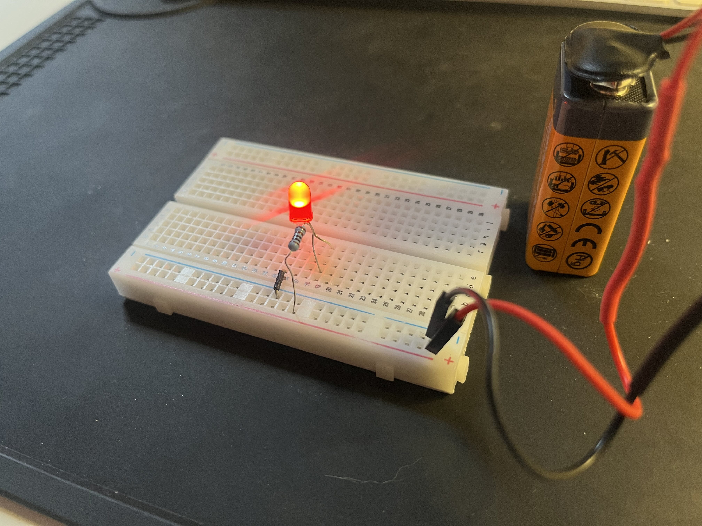

# Day 1

## CS Hardware - Ohm's Law

---

# Goal for Today

By the end of today you will:

- Build your first circuit
- Learn about Ohm's Law
- Control LED (light emitting diode) brightness using a resistor
- Use a multimeter to measure voltage, current, resistance, and continuity
- Learn how to troubleshoot circuits



---

# Today's Workflow

## Step 1

Build a circuit virtually in Tinkercad

## Step 2

Build the same circuit physically on a breadboard

## Step 3

Measure and analyze the circuit

## Step 4

Extend the circuit using potentiometer, switch, and/or button

---

# Demo: LED (Light Emitting Diode) Circuit in Tinkercad


<!-- 

INSTUCTOR NOTES:

Build out the circuit in Tinkercad. Start with point to point wiring. Show what happens without a resistor, then move to breadboard

Important Observation

- Changing resistance changes current
- Changing current changes brightness

Questions:
- What's the relationship between resistance, current and brightness?
- Why does the LED burn out?

-->

---

# What Happens Without a Resistor?

- Resistors convert electrical energy into heat.
- We use a resistor to safely limit current.
- This protects the LED from too much current.

An LED connected directly to a battery can:

- draw too much current
- overheat
- burn out

---

# Ohm's Law

## V = I × R

Voltage (V) = Current (I) * Resistance (R)

<!-- 

INSTUCTOR NOTES:

This is one of the most important equations in electronics

More voltage -> more current
More resistance -> less current 

-->

---

<!-- TODO: explain a short circuit (too much current, too little resistance) and open circuit (too little current, too much resistance) -->

<!--

# Battery Safety

Large batteries can produce a dangerous levels of current.

Do NOT short large batteries:

- lithium batteries
- car batteries 

-->

<!-- TODO: video showing what happens -->

---

# LAB BREAKOUT #1

## Tinkercad Build

Goal: *make this circuit in Tinkercad to make the LED light safely*


<!-- 

INSTUCTOR NOTES:

Expect mistakes

Your circuit may:

- not work
- work partially
- behave strangely

Professional engineers spend huge amounts of time debugging.

If your circuit does not work immediately **THAT IS NORMAL**

-->

---

# What Is Electricity?

Electricity is the movement of electrons.

Three important ideas:

- Voltage (V)
- Current (I)
- Resistance (R)


---

# Voltage

- Voltage is electrical pressure
- Voltage pushes electrons through a circuit.
- Measured in Volts (V)

<!-- - Analogy: water pressure in a pipe -->
<!-- TODO: image -->

---

# Current

- Current is flow
- Current is the movement of electrical charge.
- Measured in Amps (A)

<!-- - Analogy: water flowing through a pipe -->
<!-- TODO: image -->

---

# Resistance

- Resistance opposes current flow
- Higher resistance, less current
- Lower resistance, more current
- Measured in Ohms (Ω)


---

# Water Analogy

| Electricity | Water |
| ----------- | ----- |
| Voltage | Pressure |
| Current | Flow |
| Resistance | Narrow pipe |


---

# Polarity

- *Direction matters*
- Electricity flows through a circuit in a direction
- Some components only work when electricity flows the correct way

This is called *polarity*

<!-- TODO: image showing current flow -->

---

# LEDs Have Polarity

LED (Light Emitting Diode)

Diodes only allow current in one direction.

- Long leg = positive (+) anode
- Short leg = negative (-) cathode


---

# Demo: Physical Breadboard


---

# Safety

- Disconnect power before rewiring
- Avoid short circuits
- Wear safety glasses

<!-- TODO: image -->
---

# LAB BREAKOUT #2

## Physical Breadboard Build

Goal: *Recreate the same circuit physically*

<!-- TODO: image -->

---

# Troubleshooting

If it does NOT work:

- check polarity
- check wiring
- check loose connections
- swap components
- test battery

(sometimes you just need to take a break)

<!-- TODO: image -->

---

# Compare Tinkercad vs Physical

What are your first impressions?

<!--

INSTRUCTOR NOTES:

Tinkercad:
- easier wiring
- easier visibility

Real hardware:
- loose wires
- bad connections
- physical constraints

-->

---

# The Multimeter

## Most important electronics tool

A multimeter measures:

- voltage
- resistance
- current
- continuity
- and more!

<!-- TODO: image? tinkercad and physical multimeter -->

---

# Demo: Multimeter

<!-- 

INSTUCTOR NOTES:

Use Tinkercad and the live breadboard to make measurements using the multimeter

Measure:
- battery voltage
- LED voltage (parallel - on)
- resistance (off)
- current (series - on)
- continuity (off)

Show probes placed in parallel vs. series
-->

<!-- TODO: Insert tinkercade image diagram measuring voltage, current, resistance, continuity -->

---

# The Battery

A battery provides voltage.

Battery terminals:

- Positive (+)
- Negative (-)


---

<!-- Measuring forward voltage  -->

<!-- 

# Forward Voltage

- LEDs are not ordinary resistors.
- A green LED typically uses about 2.2 V
- This is called *forward voltage*

In a 9V circuit:

- Some voltage appears across the LED
- The rest appears across the resistor(s)

---

# Calculation

Assume:

- Battery = 9V
- LED forward voltage = 2.2V
- Resistance = 500 Ω

Remaining voltage:

# 9V − 2.2V = 6.8V

Using Ohm's Law:

```
I = V / R
I = 6.8V / 500Ω
I = 0.0136 A = 13.6 mA
```

-->

---

<!-- Resistor -->

---

<!-- Measuring current -->

---

# LAB BREAKOUT #3

## Multimeter Measurements

Measure:

- Battery voltage
- Forward voltage
- Current
- Resistance
- Continuity

---

# Demo: LED Brightness Control

Adjust LED brightness using:

- Resistor
- Potentiometer
- Button and/or switch

<!-- TODO: image of circuit -->

---

# Potentiometer (Variable resistor)

Turning the knob changes resistance.

Use:

- Center pin
- One outside pin
- Leave the other outside pin disconnected.


---

# Buttons

A button only changes the circuit while pressed.

Examples:

- Keyboard keys
- Doorbells
- Game controller buttons

<!-- TODO: image -->
---

# Switches

A switch stays in its position until changed.

Examples:

- Room light switch
- Power strip
- Flashlight switch

<!-- TODO: image -->
---

# LAB BREAKOUT #4

## LED Dimmer Switch

Goal: *Add the potentiometer, button, and/or switch to control LED brightness*

<!-- TODO: image -->

---

# Key Takeaways

<!--

INSTRUCTOR NOTES:

- Voltage pushes current
- Resistance limits current
- Current controls LED brightness
- Polarity matters
- Multimeters let us observe circuits

-->
